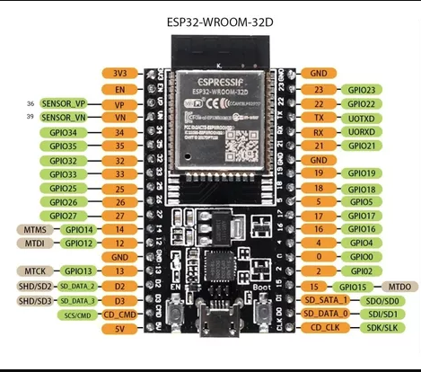

# Curso de introducción al desarrollo de aplicaciones con la placa de desarrollo ESP32 de la empresa Espressif

- Manejo de GPIOs.
- Hardware SPI y I2C.
- Conceptos de [FreeRTOS](https://www.freertos.org/index.html).
- Interrupciones.
- Manejo de temporizadores.
- Depuración.

## Requisitos
Para seguir el curso recomiendo instalar los siguientes elementos:

- Windows (Recomendado W10) o Linux (Yo uso Debian 12).
- Tener instalado [Visual Studio Code (VSC)](https://code.visualstudio.com/download).
- Instalar el plugin oficial de Espressif para VSC [plugin](https://docs.espressif.com/projects/esp-idf/en/v4.2.3/esp32/get-started/vscode-setup.html).
- Framework de Espressif (IDF).

## Placa de desarrollo a utilizar: ESP32-WROOM-D


### Nota importante 
Para tener el repo siempre actualizado ingresar el siguiente comando:
``` git submodule update --init --recursive ```




## Contribuciones

¡Las contribuciones son bienvenidas! Si tienes ejemplos adicionales, mejoras o correcciones, no dudes en enviarme un correo a germanvelardez16@gmail.com.
